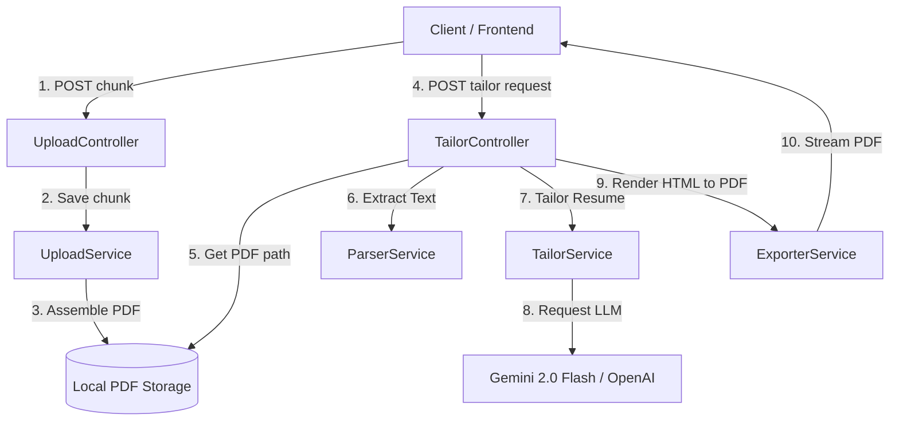

# Resume Tailoring Backend — System Documentation

This repository houses the backend codebase for the **Resume Tailoring & RAG Engine**. The system manages resumable chunked PDF uploads, extracts PDF text, utilizes LLM orchestrators (Gemini 2.0 Flash or OpenAI GPT-4o-Mini) to optimize resumes for specific job descriptions, and renders the result as an ATS-compliant PDF using Puppeteer headless browser automation.

### 📚 Detailed Module Documentation
For in-depth explanations of the system's core capabilities, consult the sub-documentation files:
- [Upload Module](file:///Users/bhanusingh/Documents/personal_projects/nest-js/nest-basics/backend/docs/UPLOAD.md) — Chunked uploading, assembly, and validation.
- [Parser Module](file:///Users/bhanusingh/Documents/personal_projects/nest-js/nest-basics/backend/docs/PARSER.md) — PDF text extraction and fallback API handlers.
- [Tailor & Exporter](file:///Users/bhanusingh/Documents/personal_projects/nest-js/nest-basics/backend/docs/TAILOR.md) — ATS prompts, AI routing, and Puppeteer A4 rendering.
- [Security Hardening](file:///Users/bhanusingh/Documents/personal_projects/nest-js/nest-basics/backend/docs/SECURITY.md) — Rate limits, body caps, and connection timeouts.

---

## 🏗️ Architecture Overview

The backend is organized into 4 core functional modules:



### 1. Upload Module (`src/upload/`)
Manages chunked, resumable file uploads to handle large resumes and prevent network disruptions.
*   **Controller:** `POST /upload/chunk` accepts files via Multer's `FileInterceptor('chunk')`.
*   **Service:** Writes chunks temporarily to `uploads/chunks/<uploadId>/<chunkIndex>`. Once the final chunk is verified, it streams them together into a final file `uploads/<uploadId>.pdf` and deletes the temporary chunks folder.
*   **Safety:** Does not assume chunks arrive sequentially. Verifies the presence of all chunks from `0` to `totalChunks - 1` before initiating assembly.

### 2. PDF Parser Module (`src/parser/`)
Reads the assembled PDF and extracts its text contents to feed the RAG pipeline.
*   **Service:** Resolves the PDF binary using `pdf-parse`.
*   **Robustness:** Supports both the legacy functional `pdf-parse` signature and the newer class-based `PDFParse` API, allowing trouble-free library updates.

### 3. Tailor & RAG Module (`src/tailor/`)
Coordinates LLM prompting and resume tailoring.
*   **Controller:** `POST /resume/tailor` receives the target `jobDescription`, `additionalInstructions` (optional), and the `uploadId` of the parsed PDF.
*   **Service:** Combines the parsed resume text, job description, and custom instructions into a structured ATS-optimization prompt.
*   **LLM Orchestrator:**
    *   If `GEMINI_API_KEY` is present, it uses the new unified `@google/genai` SDK and targets `gemini-2.0-flash`.
    *   If `OPENAI_API_KEY` is present, it falls back to the `openai` SDK and targets `gpt-4o-mini`.
    *   If neither is present, it throws a `400 Bad Request` informing the developer.

### 4. Exporter Module (`src/exporter/`)
Translates the LLM-generated tailored markdown resume into an ATS-friendly, downloadable PDF.
*   **Service:** Converts Markdown to HTML using `marked`. Injects a custom CSS print stylesheet designed with standard margins, page-break safeguards, and classic corporate typography.
*   **PDF Compiler:** Launches a headless Puppeteer browser instance (`--no-sandbox` enabled) and renders the HTML, compiling it to a print-ready A4 PDF buffer.
*   **Streamer:** Streams the resulting PDF buffer directly back to the client as an attachment download (`StreamableFile`).

---

## 🛡️ Security Hardening Guardrails

To protect operational costs, prevent server exhaustion, and mitigate Denial of Service (DoS) risks, the backend implements the following security measures:

### 1. API Throttling (Rate Limiting)
Managed via `@nestjs/throttler` and bound globally as an `APP_GUARD`:
*   **Rapid Click Protection:** `short` rate limiter allows a maximum of **2 requests per second** per IP.
*   **General API Limits:** `medium` rate limiter allows a maximum of **20 requests per minute** per IP.
*   **Heavy Resource Capping:** 
    *   `POST /resume/tailor` is strictly capped using `@Throttle` overrides to **2 requests per minute** per IP to defend against expensive LLM and Puppeteer call storms.
    *   `POST /upload/chunk` is capped to **10 requests per minute** per IP to prevent disk-write exhaustion.

### 2. Payload size limits
*   **Request Body Limits:** Globally limits incoming JSON and URL-encoded bodies to a maximum of **500 KB** in `main.ts`.
*   **Upload Physical Limits:** Configured Multer's memory limit on `/upload/chunk` to **5 MB**.
*   **Piped Validation:** Uses `ParseFilePipe` with `MaxFileSizeValidator` (5MB cap) and `FileTypeValidator` (`application/pdf` MIME type constraint).
*   **Chunk Bypass:** Enabled `skipMagicNumbersValidation: true` in `FileTypeValidator` to allow chunks (which lack standard PDF magic headers at their start offset) to validate successfully based on client-provided MIME metadata.

### 3. Server Timeout Defenses
*   **Timeout Interceptor:** Built `TimeoutInterceptor` using RxJS operators to terminate any connection taking longer than **20 seconds** with a `408 Request Timeout` exception.
*   **Resource Cleanup:** Ensures hanging model responses or Puppeteer failures don't hold the Node.js event loop hostage.

---

## 🔌 API Endpoints

### 1. Upload Chunks
*   **Endpoint:** `POST /upload/chunk`
*   **Content-Type:** `multipart/form-data`
*   **Fields:**
    *   `chunk`: Binary File (Max 5MB)
    *   `uploadId`: String (Unique ID for the uploading file session)
    *   `chunkIndex`: String/Number (0-indexed position of chunk)
    *   `totalChunks`: String/Number (Total number of chunks to receive)
*   **Response (Non-Final Chunk):**
    ```json
    {
      "message": "Chunk 0 saved",
      "complete": false
    }
    ```
*   **Response (Final Chunk - Triggers Assembly):**
    ```json
    {
      "message": "Upload complete",
      "complete": true,
      "uploadId": "test-upload-12345",
      "filePath": "/workspace/uploads/test-upload-12345.pdf"
    }
    ```

### 2. Tailor Resume
*   **Endpoint:** `POST /resume/tailor`
*   **Content-Type:** `application/json`
*   **Body:**
    ```json
    {
      "uploadId": "test-upload-12345",
      "jobDescription": "Looking for a Software Engineer...",
      "additionalInstructions": "Highlight my NestJS and TypeScript experience."
    }
    ```
*   **Response:** File stream (`Content-Type: application/pdf`, `Content-Disposition: attachment; filename="tailored_resume.pdf"`).

---

## ⚙️ Local Setup

1.  **Install dependencies:**
    ```bash
    pnpm install
    ```
2.  **Environment Configuration:**
    Create a `.env` file in the root of the `backend/` directory or export the keys in your shell:
    ```env
    PORT=8001
    GEMINI_API_KEY=your_gemini_api_key
    # OR
    OPENAI_API_KEY=your_openai_api_key
    ```
3.  **Run in development mode:**
    ```bash
    pnpm run start:dev
    ```
4.  **Run linter & compilation checks:**
    ```bash
    pnpm lint
    pnpm run build
    ```

---

## 🧪 Testing & Verification

We have provided automated test scripts under the workspace artifact directory:

*   **End-to-End Pipeline test:** Runs chunk uploads, calls PDF assembly, verifies text parsing, and checks LLM integration:
    ```bash
    node /Users/bhanusingh/.gemini/antigravity-ide/brain/f5fe6f50-92e2-4cc6-ba41-e42a4a421751/scratch/test_backend.js
    ```
*   **Puppeteer Exporter test:** Tests markdown compilation to A4 PDF in isolation:
    ```bash
    node /Users/bhanusingh/.gemini/antigravity-ide/brain/f5fe6f50-92e2-4cc6-ba41-e42a4a421751/scratch/test_exporter.js
    ```
