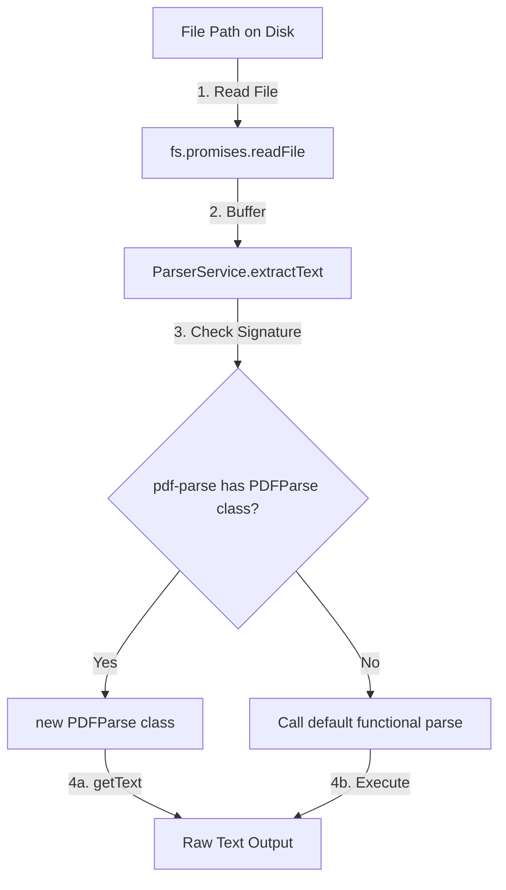

# PDF Parser Module Documentation

The Parser Module handles reading assembled PDF files from local storage and extracting their raw text. This data is subsequently passed to the AI module to perform tailoring.

---

## 📂 File Structure

*   [parser.module.ts](file:///Users/bhanusingh/Documents/personal_projects/nest-js/nest-basics/backend/src/parser/parser.module.ts): Declares the module and registers the `ParserService` for exporting.
*   [parser.service.ts](file:///Users/bhanusingh/Documents/personal_projects/nest-js/nest-basics/backend/src/parser/parser.service.ts): Implements text extraction from PDF files.

---

## ⚙️ How it Works

The parser service takes a local file path, reads it as a buffer, and feeds it into the `pdf-parse` library:



---

## 🛠️ Implementation Details

### 1. Robust Library Resolution (Version Interoperability)
The standard `pdf-parse` library usually exports a default function. However, newer versions or specific ecosystem forks (such as version 2.4.5 in this workspace) export a class-based structure (`PDFParse`). 

To support both configurations seamlessly and avoid runtime crashes on library updates, the service dynamically detects the exported shape:

```typescript
const pdfModule = pdf as unknown as PDFParseModule;

// Support modern class-based API (pdf-parse 2.x)
if (pdfModule.PDFParse) {
  const parser = new pdfModule.PDFParse({ data: dataBuffer });
  const result = await parser.getText();
  return result.text || '';
}

// Fallback to legacy functional API (pdf-parse 1.x)
let pdfFunc = pdfModule.default;
if (!pdfFunc && typeof pdf === 'function') {
  pdfFunc = pdf as unknown as (dataBuffer: Buffer) => Promise<PDFParseResult>;
}

if (typeof pdfFunc === 'function') {
  const result = await pdfFunc(dataBuffer);
  return result.text || '';
}
```

### 2. Strict Type Safety
To strictly satisfy `@typescript-eslint/no-unsafe-*` rules without using `any` casts, custom TypeScript interfaces are defined for the `pdf-parse` module exports:

```typescript
interface PDFParseResult {
  text: string;
}

interface PDFParseClassInstance {
  getText(): Promise<PDFParseResult>;
}

interface PDFParseModule {
  PDFParse?: new (options: { data: Buffer }) => PDFParseClassInstance;
  default?: (dataBuffer: Buffer) => Promise<PDFParseResult>;
}
```

---

## 🛑 Guardrails & Error Handling

*   **Existence Validation:** Checks if the target PDF file actually exists on disk before reading, throwing a `404 NotFoundException` if missing.
*   **Safe Catch Blocks:** Avoids untyped error properties. Catch blocks capture exceptions as `unknown`, assert `error instanceof Error`, and safely wrap details into a `400 BadRequestException` to prevent leaking server trace logs.
