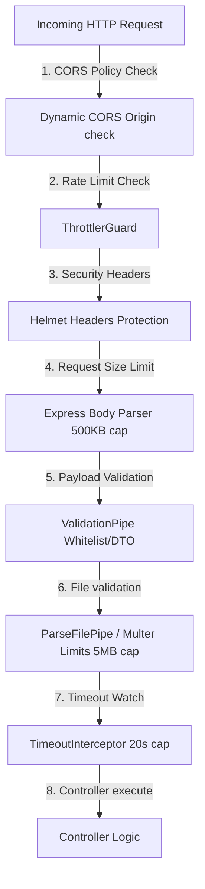

# Security Hardening Documentation

This document explains the security architecture, production-ready middlewares, and input validators configured in the backend to protect operational costs, defend against Denial of Service (DoS) attacks, secure communication channels, and sanitize input payloads.

---

## 🛡️ Defenses Blueprint



---

## 🛠️ Security Safeguards & Production Middlewares

### 1. Dynamic CORS (Cross-Origin Resource Sharing)
Restricts client-side scripting access exclusively to trusted, defined domains:
*   **Production Checks:** Reads from the `ALLOWED_ORIGINS` environment variable (comma-separated list of live frontend domains).
*   **Development Access:** Automatically bypasses checks if `NODE_ENV === 'development'` to facilitate trouble-free localhost paired development.
*   **Postman/Mobile Support:** Allows requests with no origin headers (such as server-to-server calls or mobile clients).
*   **Header Policies:** Enforces strict method and header permissions while allowing cookie-sharing credentials:
    ```typescript
    methods: 'GET,HEAD,PUT,PATCH,POST,DELETE,OPTIONS',
    credentials: true,
    allowedHeaders: 'Content-Type, Accept, Authorization',
    ```

### 2. HTTP Headers Hardening (Helmet)
Uses the `helmet` middleware in `main.ts` to automatically configure and inject HTTP security headers, protecting the application against common vulnerabilities like:
*   **Clickjacking:** Enforces Frame Options.
*   **Cross-Site Scripting (XSS):** Enforces XSS Filter headers and blocks content-type sniffing.
*   **Content Security Policy (CSP):** Sets strong browser resource fetch rules:
    ```typescript
    app.use(helmet({
      crossOriginEmbedderPolicy: false,
      contentSecurityPolicy: true,
    }));
    ```

### 3. Response Compression
Uses `compression` to Gzip/Brotli compress response payloads before sending them over the wire. This drastically reduces transit times and bandwidth costs for large payloads (such as compiled resume text streams or JSON structures).

### 4. Input Sanitization & Validation (ValidationPipe)
Enforces a global `ValidationPipe` to inspect incoming payloads:
*   **Whitelist Filtering:** Automatically strips out any extra unmapped properties sent by client requests.
*   **Strict Blocking:** Throws a `400 Bad Request` if unmapped properties are present (`forbidNonWhitelisted: true`), preventing SQL/code injection attempts.
*   **Explicit Type Transformation:** Automatically casts request strings to appropriate numbers, booleans, or DTO types.

```typescript
app.useGlobalPipes(
  new ValidationPipe({
    whitelist: true,
    forbidNonWhitelisted: true,
    transform: true,
  }),
);
```

### 5. API Rate Limiting (Throttling)
Protects the API gateway from brute-force request storms:
*   **Provider:** Global `ThrottlerGuard` provider (`APP_GUARD`) in `app.module.ts`.
*   **Tiered Config:**
    *   `short`: Caps requests to **2 per second** per IP (prevents double-clicks).
    *   `medium`: General API limit of **20 per minute** per IP.
*   **Controller Override Limits:**
    *   `/resume/tailor`: Strictly capped to **2 requests per minute** per IP.
    *   `/upload/chunk`: Capped to **10 requests per minute** per IP.

### 6. Payload size limits
*   **Express Body Limit:** Restricts standard JSON/urlencoded request bodies to **500 KB** max.
*   **File Limits:** Capped at **5 MB** on `/upload/chunk` using Multer constraints and a NestJS `MaxFileSizeValidator`.
*   **Validation Pipe:** `FileTypeValidator({ fileType: 'application/pdf', skipMagicNumbersValidation: true })` restricts chunks to PDF mimetypes without failing on partial chunk magic numbers.

### 7. Timeout Defenses
*   **RxJS Interceptor:** Automatically cuts off any request taking longer than **20 seconds** with a `408 Request Timeout` exception.

### 8. Static Type Hardening & ESLint Restrictions
*   **Centralized Types Folder:** All type and interface definitions (for files, parsers, and requests) are grouped in a dedicated folder: `src/types/` (includes `pdf-parse.types.ts`, `upload.types.ts`, and `tailor.types.ts`).
*   **No-Any Rule Enforcement:** Configured the `@typescript-eslint/no-explicit-any` ESLint rule as a strict `"error"`, forbidding any use of the `any` type.
*   **Base-to-String Guarding:** Checked and type-guarded all catches of `unknown` exceptions to prevent unsafe object stringification, conforming to `@typescript-eslint/no-base-to-string`.
