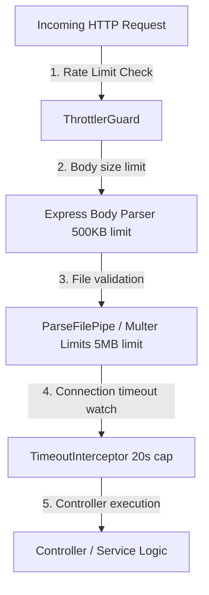

# Security Hardening Documentation

This document explains the security architecture and defenses configured in the backend to protect operational costs, prevent memory/CPU exhaustion, and block malicious attacks (DoS/spam).

---

## 🛡️ Defenses Blueprint



---

## 🛠️ Security Safeguards

### 1. API Rate Limiting (Throttling)
Implemented via `@nestjs/throttler` to prevent endpoint abuse.
*   **Global Provider:** Registered as a global guard in `app.module.ts`:
    ```typescript
    {
      provide: APP_GUARD,
      useClass: ThrottlerGuard,
    }
    ```
*   **Layered Limits:**
    *   `short`: Caps requests to **2 per second** per IP to protect against rapid double-clicks and script storms.
    *   `medium`: General API limit capping requests to **20 per minute** per IP.
*   **Endpoint Overrides:**
    *   `/resume/tailor`: Decorated with `@Throttle({ default: { limit: 2, ttl: 60000 } })` (max 2 per minute per IP) to guard CPU-intensive Puppeteer and paid LLM endpoints.
    *   `/upload/chunk`: Decorated with `@Throttle({ default: { limit: 10, ttl: 60000 } })` (max 10 per minute per IP) to defend against disk-write exhaustion.

### 2. Preventing Payload Bloat (DoS Protection)
*   **Request Body Capping:** Configured in `main.ts` using Express body-parsers to reject any JSON or URL-encoded body larger than **500 KB** (returns `413 Payload Too Large`):
    ```typescript
    app.use(express.json({ limit: '500kb' }));
    app.use(express.urlencoded({ extended: true, limit: '500kb' }));
    ```
*   **File Upload Size Caps:** Capped at two levels on `/upload/chunk`:
    1.  **Multer Interceptor Level:** Capped at **5 MB** to drop large chunks before memory allocation:
        ```typescript
        FileInterceptor('chunk', { limits: { fileSize: 5 * 1024 * 1024 } })
        ```
    2.  **NestJS Validator Level:** Capped using `MaxFileSizeValidator` for double-checking:
        ```typescript
        new MaxFileSizeValidator({ maxSize: 5 * 1024 * 1024 })
        ```

### 3. Strict File Type Guarding
*   **MIME Validation:** Restricts uploads exclusively to PDF files via `FileTypeValidator({ fileType: 'application/pdf' })`.
*   **Chunk Support:** Since uploading chunks divides a PDF file into pieces, subsequent chunks do not start with the standard `%PDF` binary magic numbers (which causes binary type-checks to fail). Setting `skipMagicNumbersValidation: true` bypasses magic number checks and validates solely on the client-provided MIME metadata, allowing resumable chunking to succeed safely.

### 4. Connection Timeout Limits
*   **RxJS Interceptor:** Built `TimeoutInterceptor` in [timeout.interceptor.ts](file:///Users/bhanusingh/Documents/personal_projects/nest-js/nest-basics/backend/src/common/interceptors/timeout.interceptor.ts) to force-kill connections that hang on Puppeteer renders or third-party LLM endpoints:
    ```typescript
    return next.handle().pipe(
      timeout(20000), // 20-second connection cap
      catchError((err: unknown) => {
        if (err instanceof TimeoutError) {
          return throwError(() => new RequestTimeoutException('Operation took too long to respond.'));
        }
        return throwError(() => err);
      }),
    );
    ```
*   **Global Registration:** Registered in `main.ts` using `app.useGlobalInterceptors(new TimeoutInterceptor())` to protect all endpoints by default.
