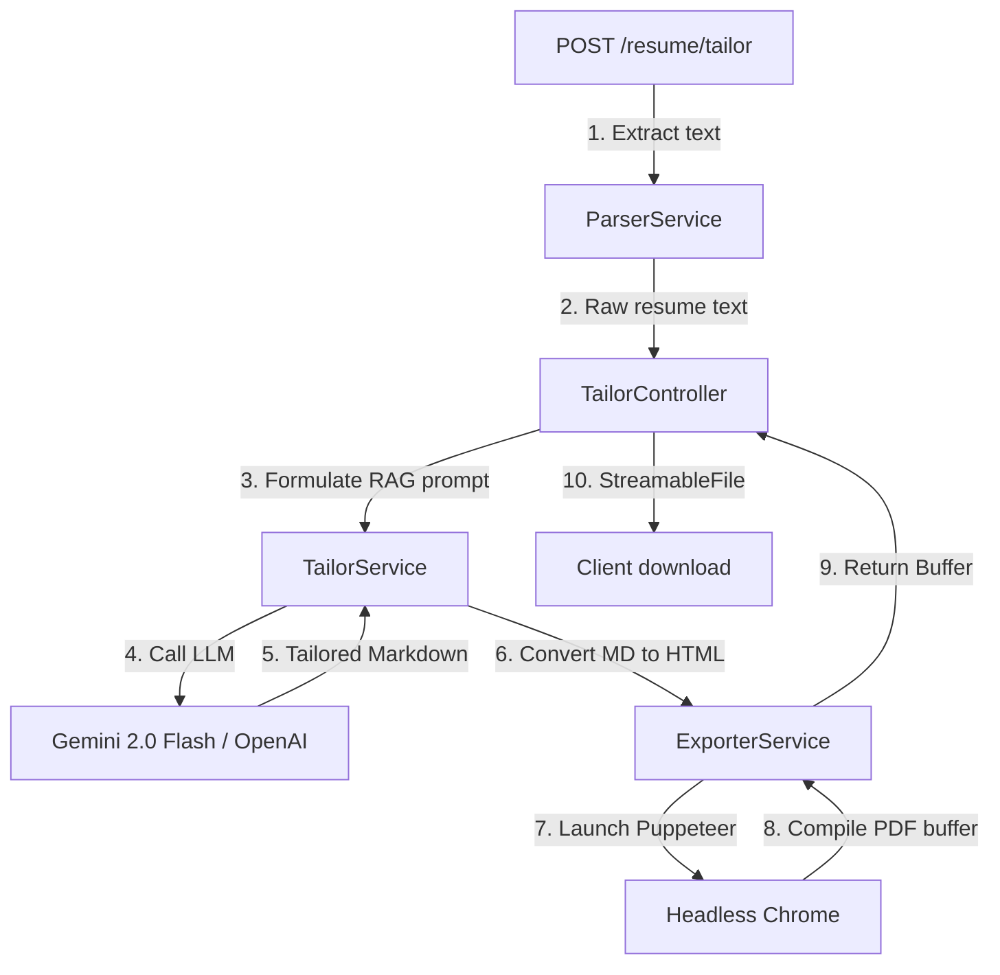

# Tailor & PDF Exporter Module Documentation

The Tailor and Exporter modules process Job Descriptions, tailor candidate resumes using Large Language Models, convert tailored Markdown to ATS-friendly HTML, and generate downloadable PDFs.

---

## 📂 File Structure

*   **Tailor Module (`src/tailor/`)**:
    *   [tailor.module.ts](file:///Users/bhanusingh/Documents/personal_projects/nest-js/nest-basics/backend/src/tailor/tailor.module.ts): Connects parser, exporter, and tailor logic.
    *   [tailor.controller.ts](file:///Users/bhanusingh/Documents/personal_projects/nest-js/nest-basics/backend/src/tailor/tailor.controller.ts): Exposes `POST /resume/tailor` and streams the PDF back.
    *   [tailor.service.ts](file:///Users/bhanusingh/Documents/personal_projects/nest-js/nest-basics/backend/src/tailor/tailor.service.ts): Formulates the ATS prompts and routes LLM requests.
*   **Exporter Module (`src/exporter/`)**:
    *   [exporter.module.ts](file:///Users/bhanusingh/Documents/personal_projects/nest-js/nest-basics/backend/src/exporter/exporter.module.ts): Bundles and exports PDF generation services.
    *   [exporter.service.ts](file:///Users/bhanusingh/Documents/personal_projects/nest-js/nest-basics/backend/src/exporter/exporter.service.ts): Translates Markdown to HTML, styles the layout, and invokes Puppeteer to render the PDF.

---

## ⚙️ How it Works

The end-to-end tailoring and exporting pipeline operates as follows:



---

## 🛠️ Implementation Details

### 1. Dual-Client AI Service
The `TailorService` supports both **Gemini** (via `@google/genai`) and **OpenAI** (via `openai`). The service checks configured environment variables on instantiation and selects the appropriate provider:

*   **Gemini Client (Primary):** Initializes if `GEMINI_API_KEY` is present. Utilizes the high-speed `gemini-2.0-flash` model.
*   **OpenAI Client (Fallback):** Initializes if `OPENAI_API_KEY` is present. Utilizes `gpt-4o-mini`.
*   **Prompt Formulation:** Enforces strict Markdown output. Clean helper functions strip any markdown code block wrappers (like ` ```markdown `) returned by the models to output raw, valid markdown content.

### 2. Puppeteer HTML-to-PDF Conversion
The `ExporterService` translates Markdown into an A4 PDF via headless browser automation:
1.  **Markdown Parse:** Uses `marked` to generate structured HTML nodes.
2.  **CSS Injection:** Wraps the content in a custom, ATS-friendly stylesheet utilizing standard margins (`20mm 15mm 20mm 15mm`), default fonts (`Arial`/`Helvetica`), and strict print page-break guidelines (`page-break-inside: avoid;`).
3.  **Headless Print:** Launches Puppeteer with safe flags (`--no-sandbox`, `--disable-setuid-sandbox`), sets the HTML content, waits for DOM content loading, and calls `page.pdf({ format: 'A4', printBackground: true })` to capture the print-preview buffer.

---

## 🛑 Guardrails & Limits

*   **Rate Limiting:** `/resume/tailor` is strictly throttled to **2 requests per minute** per IP address to safeguard against API cost spikes and CPU exhaustion.
*   **Payload Size Limits:** Job description and custom instruction JSON payload sizes are capped at **500 KB** globally.
*   **Operation Timeout:** Connection is terminated after **20 seconds** via the `TimeoutInterceptor` if Puppeteer rendering or the LLM API call hangs.
