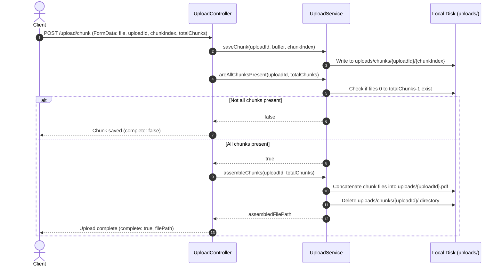

# Upload Module Documentation

The Upload Module handles resumable chunked PDF uploads. It allows clients to break down large resume files into small chunks, upload them sequentially or concurrently, and verify that the upload is completed correctly.

---

## 📂 File Structure

*   [upload.module.ts](file:///Users/bhanusingh/Documents/personal_projects/nest-js/nest-basics/backend/src/upload/upload.module.ts): Declares the NestJS module, registers `UploadController` and `UploadService`, and exports the service.
*   [upload.controller.ts](file:///Users/bhanusingh/Documents/personal_projects/nest-js/nest-basics/backend/src/upload/upload.controller.ts): Exposes the HTTP endpoint and handles file validation and request inputs.
*   [upload.service.ts](file:///Users/bhanusingh/Documents/personal_projects/nest-js/nest-basics/backend/src/upload/upload.service.ts): Manages physical disk-writes, chunk counting, and PDF assembly.

---

## ⚙️ How Chunked Uploads Work

The chunked upload workflow operates as follows:



---

## 🛠️ Implementation Details

### 1. Saving Chunks
Each chunk received is written as a file in a session-specific folder:
*   Folder: `uploads/chunks/<uploadId>/`
*   Filename: `<chunkIndex>` (e.g. `0`, `1`, `2`)

### 2. State-independent Assembly Verification
To ensure robustness against concurrent uploads and out-of-order delivery, the backend does *not* trigger assembly solely based on the arrival of the last chunk index. Instead, every chunk upload evaluates if all chunks from `0` to `totalChunks - 1` exist on disk:
```typescript
areAllChunksPresent(uploadId: string, totalChunks: number): boolean {
  const chunkFolder = path.join(this.chunksDir, uploadId);
  if (!fs.existsSync(chunkFolder)) return false;

  for (let i = 0; i < totalChunks; i++) {
    const chunkPath = path.join(chunkFolder, i.toString());
    if (!fs.existsSync(chunkPath)) return false;
  }
  return true;
}
```

### 3. File Assembly
When all chunks are present:
1.  A sequential write stream is opened to `uploads/<uploadId>.pdf`.
2.  Each chunk file from `0` to `totalChunks - 1` is read synchronously or asynchronously and written in sequence to the final destination.
3.  The write stream is closed.
4.  The temporary chunk directory is recursively deleted (`fs.promises.rm(..., { recursive: true })`).

---

## 🛑 Guardrails & Limits

*   **Size Constraint:** Each chunk is restricted to a maximum of **5 MB** using Multer's file interceptor limit options and a NestJS `MaxFileSizeValidator`.
*   **MIME Validation:** Validated via `ParseFilePipe` with a `FileTypeValidator` targeting `application/pdf`. 
*   **Bypassing Magic Numbers:** Since partial chunks of a PDF do not begin with the standard `%PDF` header bytes, `skipMagicNumbersValidation: true` is configured. This instructs NestJS to check the client-provided MIME type rather than scanning binary signatures.
*   **Rate Limits:** Capped at **10 requests per minute** per IP to defend against disk-space exhaustion.
